<h2>TensorFlow-FlexUNet-Image-Segmentation-Transverse-Plane-Prostate-Cancer-MRI (2026/07/28)</h2>
Sarah T. Arai 
Software Laboratory antillia.com  
This is the first experiment of Image Segmentation for <b>Transverse-Plane-Prostate-Cancer-MRI</b> based on 
our <a href="https://github.com/sarah-antillia/TensorFlow-FlexUNet-Image-Segmentation-Model">
TensorFlow-FlexUNet-Image-Segmentation-Model</a>
 (<b>TensorFlow Flexible UNet Image Segmentation Model for Multiclass</b>), and a 512x512 pixels upscaled PNG
 <a href="https://drive.google.com/file/d/1zP9eqRyVVSWjD8p0YIhQcslS1D-uQVyY/view?usp=sharing">
Transverse-Plane-Prostate-Cancer-MRI-ImageMask-Dataset.zip</a>, which was derived by us from   
<a href="https://www.kaggle.com/datasets/tgprostata/transverse-plane-prostate-dataset">
<b>Transverse Plane Prostate Dataset
</b>
</a> by TG Prostata.
  

<b>Actual Image Segmentation for Transverse-Plane-Prostate-Cancer-MRI Images of 512x512 pixels</b> 
As shown below, the inferred masks predicted by our segmentation model trained by the dataset appear similar to 
the ground truth masks.
  
<table>
<tr>
<th>Input: image</th>
<th>Mask (ground_truth)</th>
<th>Prediction: inferred_mask</th>
</tr>
<tr>
<td>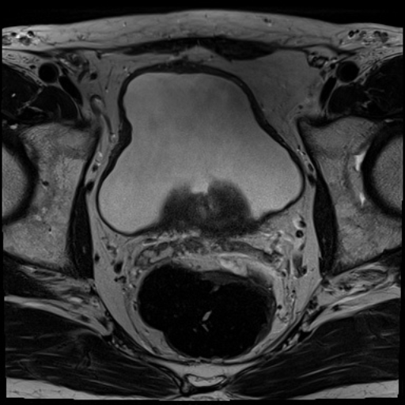</td>
<td>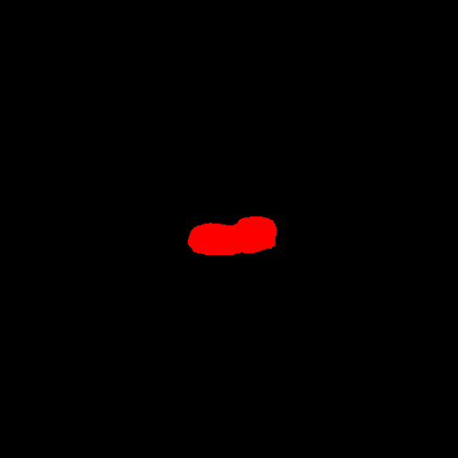</td>
<td>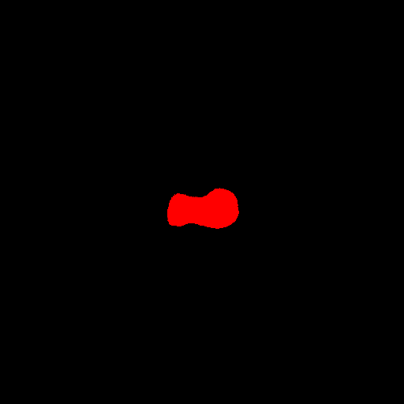</td>
</tr>

<tr>
<td>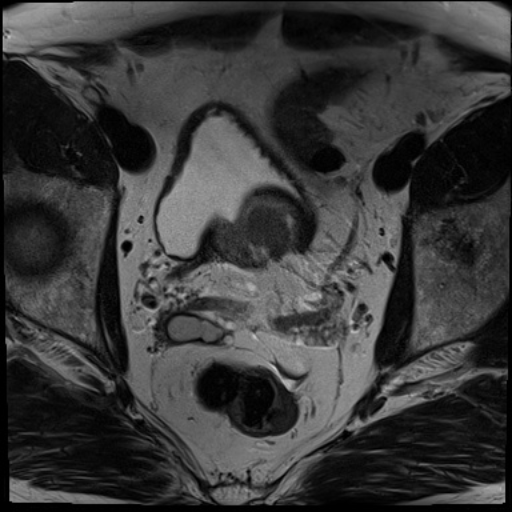</td>
<td></td>
<td></td>
</tr>

<tr>
<td>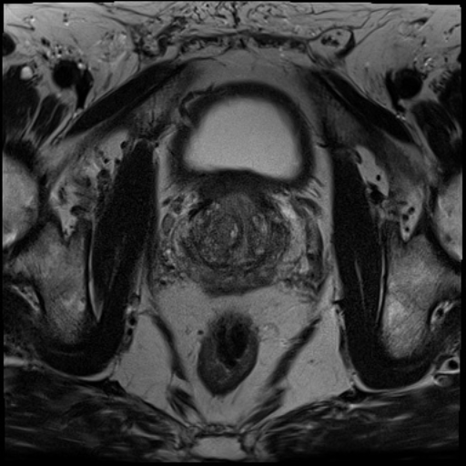</td>
<td>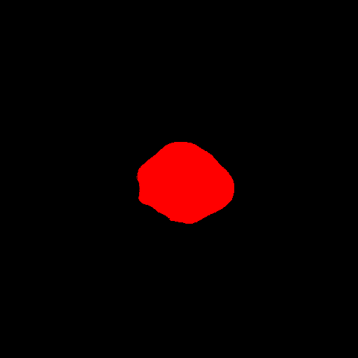</td>
<td>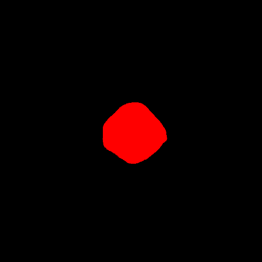</td>
</tr>
</table>

 
<h3>1. Dataset Citation</h3>
The dataset used here was derived from   
<a href="https://www.kaggle.com/datasets/tgprostata/transverse-plane-prostate-dataset">
<b>Transverse Plane Prostate Dataset
</b>
</a> by TG Prostata.
 
 
The following explanation was taken from the above web site.
  
<b>About Dataset</b> 
This dataset contains a total of 1528 prostate MRI images in the transverse plane. 
The images and classification were provided by <a href="https://www.cancerimagingarchive.net/collection/prostatex/"> 
<b>PROSTATEx</b></a> Dataset and Documentation. 
The objective of the dataset is to train a convolutional neural network called Small VGG Net 
and classify new images into clinically significant and clinically non-significant 
for a systems engineering undergraduate thesis at the Autonomous University of Bucaramanga (UNAB).
  
Data Selection and Manipulation 
A total of 64 patient images were taken. These patients should have a single prostate MRI finding for more 
accurate training. 
We then converted all images from DICOM to JPEG. 
Finally, we separated the images into two groups following the retention method. 30% of the images were 
from the validation group and the rest from the training group. 
As a result, we have two groups (significant and non-significant) divided into training (70%) and validation (30%) groups.
  
Thesis group 
Director: Leonardo Hernán Talero Sarmiento  
ltalero@unab.edu.co 
 
Student 
Juan Felipe Consuegra Rodríguez 
jconsuegra869@unab.edu.co 
Yeison Omar Hernández Suárez 
yhernandes557@unab.edu.co 
 
<b>Citation</b> 
Geert Litjens, Oscar Debats, Jelle Barentsz, Nico Karssemeijer, and Henkjan Huisman.  
<a href="https://www.cancerimagingarchive.net/collection/prostatex/">ProstateX Challenge data<a>,  
The Cancer Imaging Archive (2017). DOI: 10.7937/K9TCIA.2017.MURS5CL
  
<b>License</b> 
Unknown
 
 
<h3>
2 Transverse-Plane-Prostate-Cancer-MRI ImageMask Dataset
</h3>
<h3>2.1 Transverse-Plane-Prostate-Cancer-MRI ImageMask Dataset</h3>
 If you would like to train this Transverse-Plane-Prostate-Cancer-MRI Segmentation model by yourself,
 please download the dataset from the google drive  
 <a href="https://drive.google.com/file/d/1zP9eqRyVVSWjD8p0YIhQcslS1D-uQVyY/view?usp=sharing">
Transverse-Plane-Prostate-Cancer-MRI-ImageMask-Dataset.zip</a>
, expand the downloaded ImageMaskDataset and put it under <b>./dataset</b> folder to be
 
<pre>
./dataset
└─Transverse-Plane-Prostate-Cancer-MRI
    ├─test
    │   ├─images
    │   └─masks
    ├─train
    │   ├─images
    │   └─masks
    └─valid
        ├─images
        └─masks
</pre>
 
<b>Transverse-Plane-Prostate-Cancer-MRI Statistics</b> 
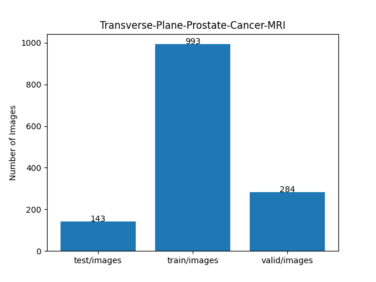 
 
As shown above, the number of images of train and valid datasets is not enough to use for the
 training set of our segmentation model.
 
 
<h3>2.2 Derivation of ImageMask Dataset</h3>
The folder structure of the original dataset is the following, but it contains no annotation (mask) files, because it is 
an image classification dataset.
<pre>
./Prostate Dataset
  ├─train
  │   ├─notsignificant
  │   └─significant
  └─validdation
       ├─notsignificant
       └─significant
</pre>
<b>Step 1</b> 
We generated a 512x512 pixels upscaled PNG master images dataset from all JPG image files  
in 
<b>notsignificant </b> and <b>significant</b> of <b>train</b> and <b>validation</b> subfolders
of Prostate Dataset.
  
<b>Step 2</b> 
We generated the pseudo masks corresponding to the master images by applying 
a segmentation (inference) method of a pretrained FlexUNet model
<a href="https://github.com/sarah-antillia/TensorFlow-FlexUNet-Image-Segmentation-PROMISE12-Prostate-Cancer">
TensorFlow-FlexUNet-Image-Segmentation-PROMISE12-Prostate-Cancer
</a> to all master images, without human annotation experts.
  
<b>Step 3</b> 
We generated our own 
 <a href="https://drive.google.com/file/d/1zP9eqRyVVSWjD8p0YIhQcslS1D-uQVyY/view?usp=sharing">
Transverse-Plane-Prostate-Cancer-MRI-ImageMask-Dataset</a> from
all pairs of the master images and their corresponding pseudo masks, but we
 excluded all black empty masks and their corresponding images. 
 
<h3>2.3 Train Sample Images and Masks</h3>
<b>Train sample images</b> 
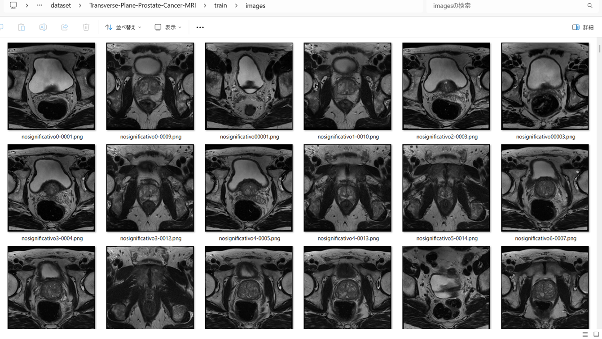
 
<b>Train sample masks</b> 
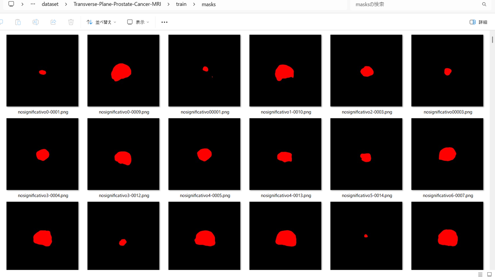
 
<h3>
3 Train TensorFlowFlexUNet Model
</h3>
 We trained Transverse-Plane-Prostate-Cancer-MRI TensorFlowFlexUNet Model by using the 
<a href="./projects/TensorFlowFlexUNet/Transverse-Plane-Prostate-Cancer-MRI/train_eval_infer.config"> <b>train_eval_infer.config</b></a> file.  
Please move to ./projects/TensorFlowFlexUNet/Transverse-Plane-Prostate-Cancer-MRI and run the following bat file. 
<pre>
>1.train.bat
</pre>
, which simply runs the following command. 
<pre>
>python ../../../src/TensorFlowFlexUNetTrainer.py ./train_eval_infer.config
</pre>

<b>Model parameters</b> 
Defined a small <b>base_filters = 16 </b> and large <b>base_kernels = (11,11)</b> for the first Conv Layer of Encoder Block of 
<a href="./src/TensorFlowFlexUNet.py">TensorFlowFlexUNet.py</a> 
and a large <b>num_layers = 8</b> (including a bridge between Encoder and Decoder Blocks).
<pre>
[model]
;You may specify your own UNet class derived from our TensorFlowFlexModel
model         = "TensorFlowFlexUNet"
image_width    = 512
image_height   = 512
image_channels = 3
input_normalize = True
normalization  = False
num_classes    = 2
base_filters   = 16
base_kernels   = (11,11)
num_layers     = 8
dropout_rate   = 0.05
dilation       = (1,1)
</pre>
<b>Learning rate</b> 
Defined a small learning rate.  
<pre>
[model]
learning_rate  = 0.00007
</pre>
<b>Loss and metrics functions</b> 
Specified "categorical_crossentropy" and <a href="./src/dice_coef_multiclass.py">"dice_coef_multiclass"</a>. 
<pre>
[model]
loss           = "categorical_crossentropy"
metrics        = ["dice_coef_multiclass"]
</pre>
<b>Dataset class</b> 
Specifed <a href="./src/ImageCategorizedMaskDataset.py">ImageCategorizedMaskDataset</a> class. 
<pre>
[dataset]
class_name    = "ImageCategorizedMaskDataset"
</pre>
 
<b>Learning rate reducer callback</b> 
Enabled learing_rate_reducer callback, and a small reducer_patience.
<pre> 
[train]
learning_rate_reducer = True
reducer_factor     = 0.4
reducer_patience   = 4
</pre>
<b>Early stopping callback</b> 
Enabled early stopping callback with patience parameter.
<pre>
[train]
patience      = 10
</pre>
<b>RGB Color map</b> 
Specifed rgb color map dict for Transverse-Plane-Prostate-Cancer-MRI 1+1 classes. 
<pre>
[mask]
mask_datatyoe    = "categorized"
mask_file_format = ".png"
;Transverse-Plane-Prostate-Cancer-MRIrgb color map dict for 1+1 classes.
;                      Cancer:red
rgb_map = {(0,0,0):0, (255, 0, 0):1 }
</pre>
<b>Infer section</b> 
<pre>
[infer] 
images_dir    = "./mini_test/images/"
output_dir    = "./mini_test_output/"
</pre>
<b>Epoch change inference callback</b> 
Enabled <a href="./src/EpochChangeInferencer.py">epoch_change_infer callback</a></b>. 
<pre>
[train]
epoch_change_infer       = True
epoch_change_infer_dir   =  "./epoch_change_infer"
num_infer_images         = 6
</pre>
By using this callback, on every epoch_change, the inference procedure can be called
 for 6 images in <b>mini_test/images</b> folder specified in <b>infer</b> section. This will help you confirm how the predicted mask changes 
 at each epoch during your training process.  
<!--
  
As shown below, early in the model training, the predicted masks from our UNet segmentation model showed 
discouraging results.
 However, as training progressed through the epochs, the predictions gradually improved. 
   
 -->
 
<b>Epoch_change_inference output at starting (epoch 1,2,3)</b> 
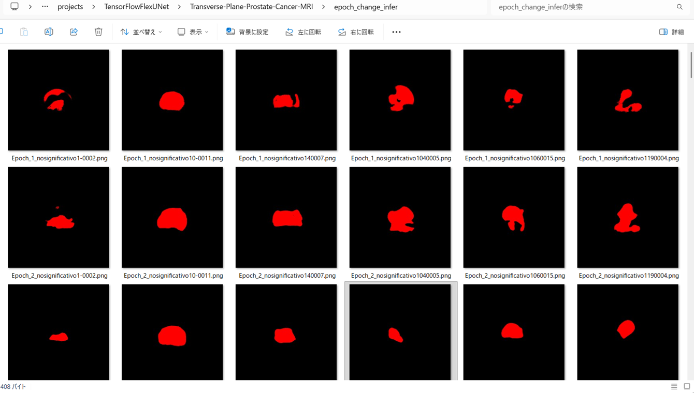 
 
<b>Epoch_change_inference output at middlepoint (epoch 16,17,18)</b> 
 
 

<b>Epoch_change_inference output at ending (epoch 33,34,35)</b> 
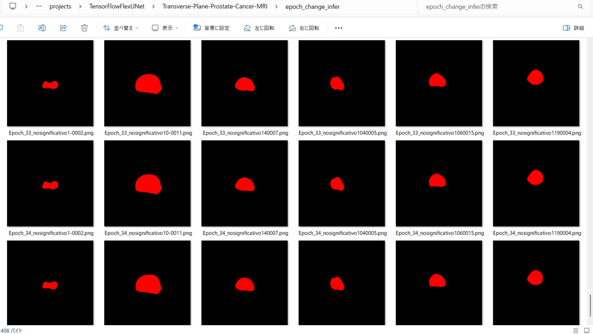 
 

In this experiment, the training process was stopped at epoch 35 by EarlyStoppingCallback.  
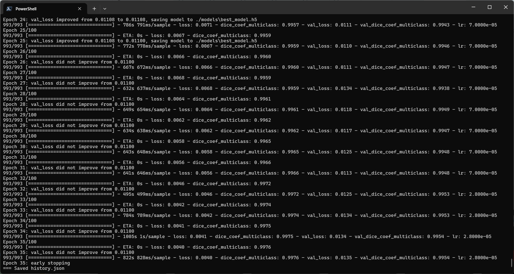 
 

<a href="./projects/TensorFlowFlexUNet/Transverse-Plane-Prostate-Cancer-MRI/eval/train_metrics.csv">train_metrics.csv</a> 
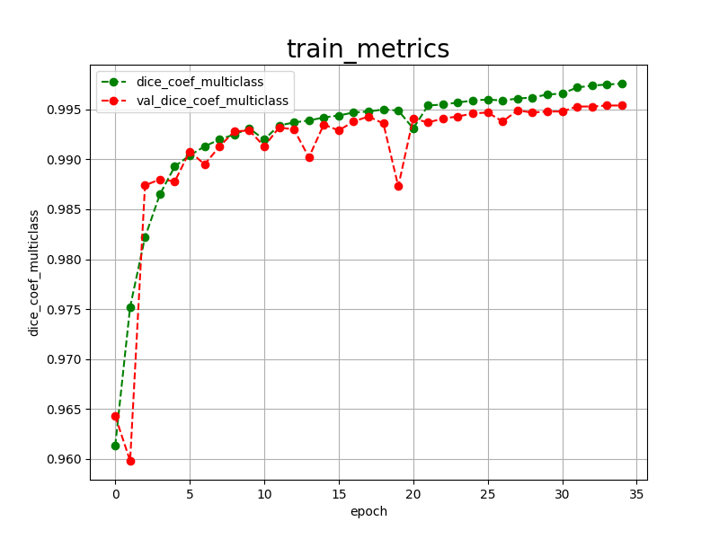 

 
<a href="./projects/TensorFlowFlexUNet/Transverse-Plane-Prostate-Cancer-MRI/eval/train_losses.csv">train_losses.csv</a> 
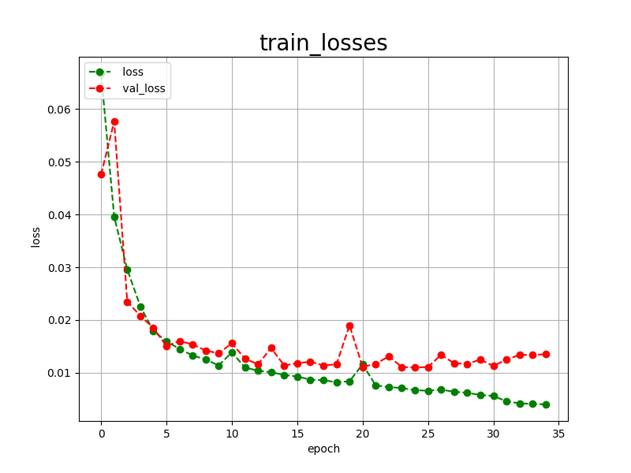 
 
<h3>
4 Evaluation
</h3>
Please move to <b>./projects/TensorFlowFlexUNet/Transverse-Plane-Prostate-Cancer-MRI</b> folder,
and run the following bat file to evaluate TensorFlowUNet model for Transverse-Plane-Prostate-Cancer-MRI. 
<pre>
>./2.evaluate.bat
</pre>
This bat file simply runs the following command.
<pre>
>python ../../../src/TensorFlowFlexUNetEvaluator.py ./train_eval_infer_aug.config
</pre>

Evaluation console output: 
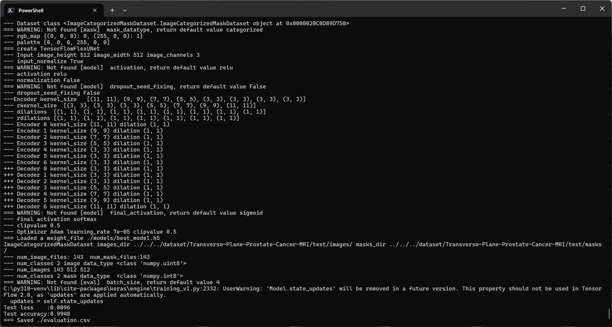
  Image-Segmentation-Transverse-Plane-Prostate-Cancer-MRI

<a href="./projects/TensorFlowFlexUNet/Transverse-Plane-Prostate-Cancer-MRI/evaluation.csv">evaluation.csv</a> 
The loss (categorical_crossentropy) to this <b>Transverse-Plane-Prostate-Cancer-MRI/test</b> was very low 
and dice_coef_multiclass very high as shown below.
 
<pre>
categorical_crossentropy,0.0096
dice_coef_multiclass,0.9948
</pre>
 
<h3>
5 Inference
</h3>
Please move to a <b>./projects/TensorFlowFlexUNet/Transverse-Plane-Prostate-Cancer-MRI</b> folder 
,and run the following bat file to infer segmentation regions for images by the Trained-TensorFlowUNet model for Transverse-Plane-Prostate-Cancer-MRI. 
<pre>
>./3.infer.bat
</pre>
This simply runs the following command.
<pre>
>python ../../../src/TensorFlowFlexUNetInferencer.py ./train_eval_infer_aug.config
</pre>

<b>mini_test_images</b> 
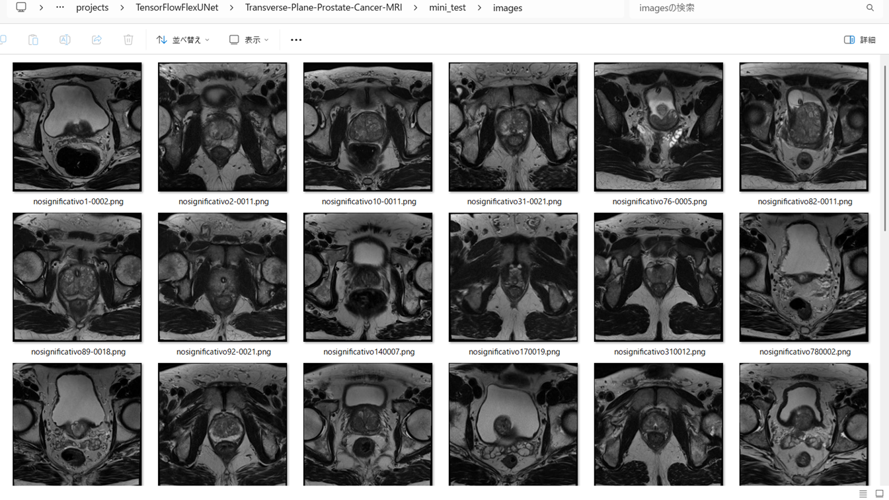 
<b>mini_test_mask(ground_truth)</b> 
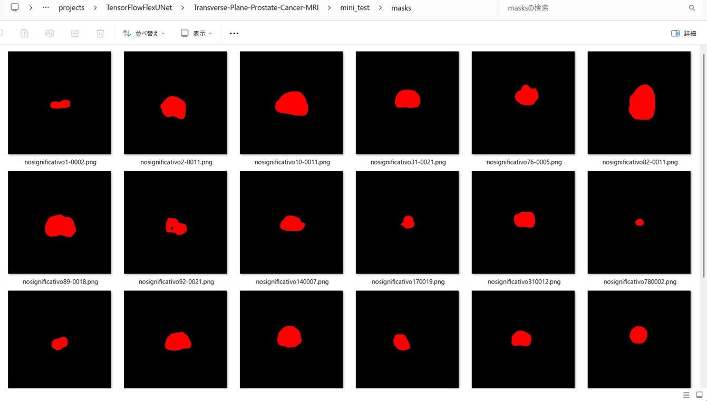 

<b>Inferred test masks</b> 
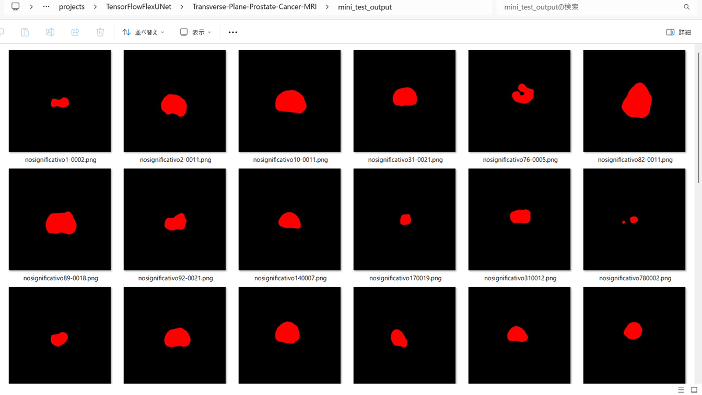 
 

<b>Enlarged images and masks of Transverse-Plane-Prostate-Cancer-MRI Images of 512x512 pixels</b> 
As shown below, the inferred masks predicted by our segmentation model trained by the dataset appear similar 
to the ground truth masks, except the second case.
  
<table>
<tr>
<th>Image</th>
<th>Mask (ground_truth)</th>
<th>Inferred-mask</th>
</tr>
<tr>
<td>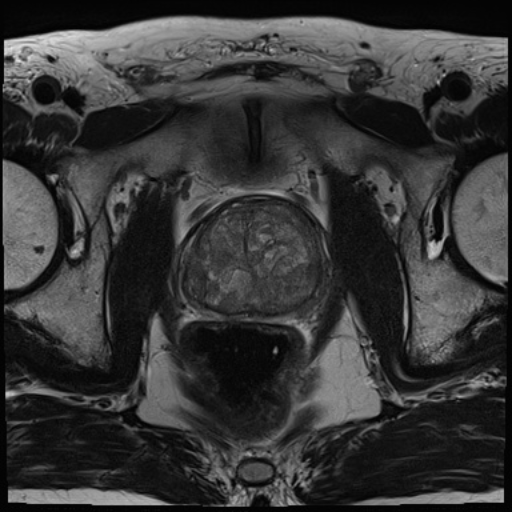</td>
<td>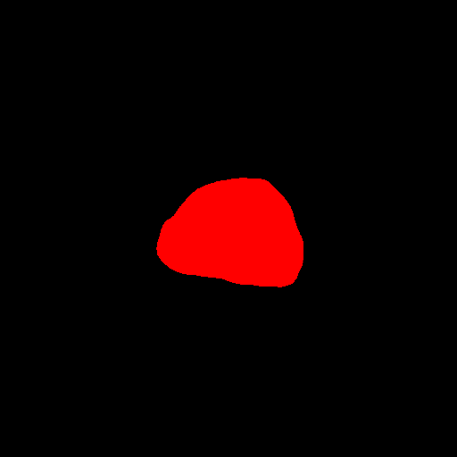</td>
<td>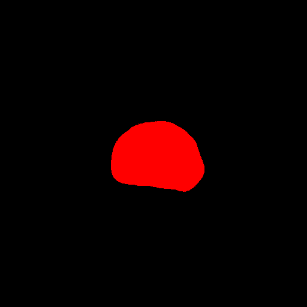</td>

</tr>

<tr>
<td>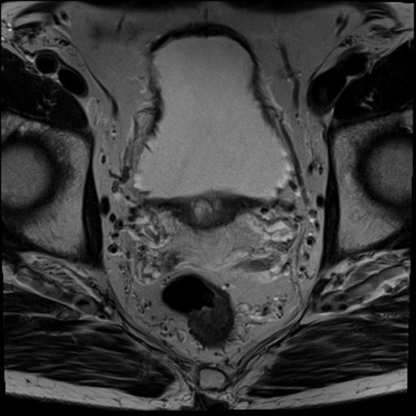</td>
<td>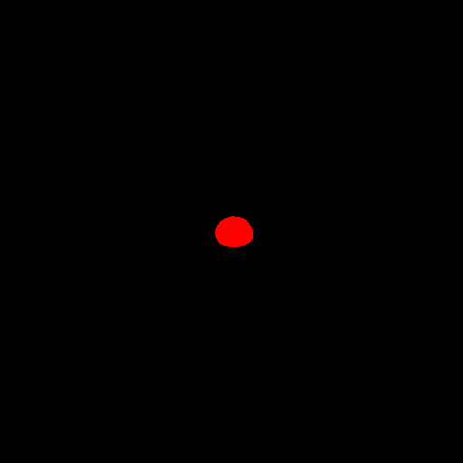</td>
<td>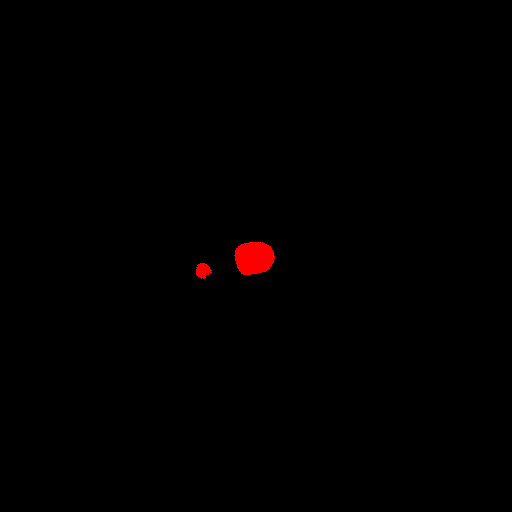</td>
</tr>

<tr>
<td>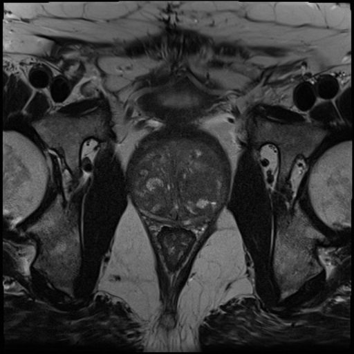</td>
<td>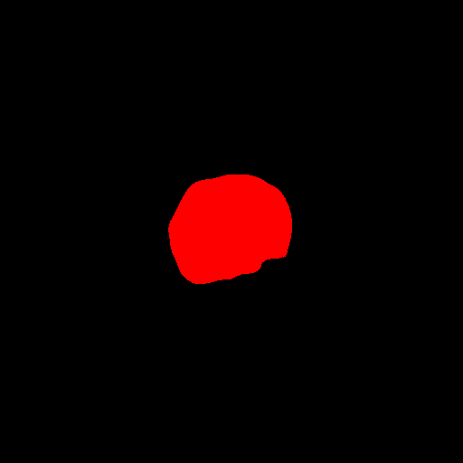</td>
<td>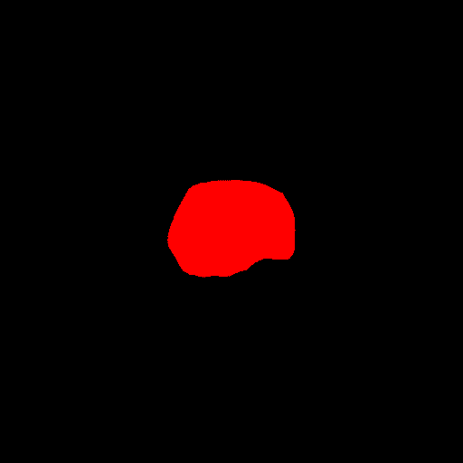</td>
</tr>

<tr>
<td></td>
<td></td>
<td></td>
</tr>

<tr>
<td>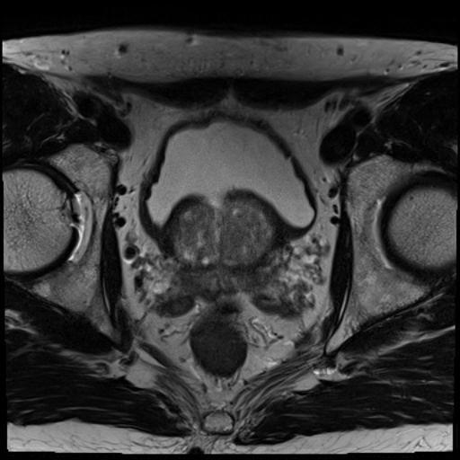</td>
<td></td>
<td></td>
</tr>

<tr>
<td>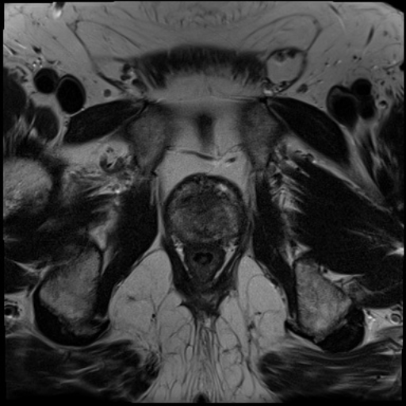</td>
<td></td>
<td></td>
</tr>
</table>

 
<h3>
References
</h3>
<b>1. Evaluation of prostate segmentation algorithms for MRI: The PROMISE12 challenge</b> 
Geert Litjens, Robert Toth, Wendy van de Ven, Caroline Hoeks, Sjoerd Kerkstra, Bram van Ginneken,  
Graham Vincent, Gwenael Guillard, Neil Birbeck, Jindang Zhang, Robin Strand, Filip Malmberg,  
Yangming Ou, Christos Davatzikos, Matthias Kirschner, Florian Jung, Jing Yuan, Wu Qiu, Qinquan Gao, 
 Philip “Eddie” Edwards, Bianca Maan, Ferdinand van der Heijden, Soumya Ghose, Jhimli Mitra, 
  Jason Dowling, Dean Barratt, Henkjan Huisman, Anant Madabhushi 
<a href="https://www.sciencedirect.com/science/article/abs/pii/S1361841513001734?via%3Dihub">
https://www.sciencedirect.com/science/article/abs/pii/S1361841513001734?via%3Dihub</a>
  
<b>2. TensorFlow-FlexUNet-Image-Segmentation-PROMISE12-Prostate-Cancer</b> 
Toshiyuki Arai 
<a href="https://github.com/sarah-antillia/TensorFlow-FlexUNet-Image-Segmentation-PROMISE12-Prostate-Cancer">
https://github.com/sarah-antillia/TensorFlow-FlexUNet-Image-Segmentation-PROMISE12-Prostate-Cancer</a>
  
<b>3. TensorFlow-FlexUNet-Image-Segmentation-Prostate158-Prostate-Tumor-T2</b> 
Toshiyuki Arai 
<a href="https://github.com/sarah-antillia/TensorFlow-FlexUNet-Image-Segmentation-Prostate158-Prostate-Tumor-T2">
https://github.com/sarah-antillia/TensorFlow-FlexUNet-Image-Segmentation-Prostate158-Prostate-Tumor-T2</a>
  
<b>4. TensorFlow-FlexUNet-Image-Segmentation-Prostate-MRI</b> 
Toshiyuki Arai 
<a href="https://github.com/sarah-antillia/TensorFlow-FlexUNet-Image-Segmentation-Prostate-MRI">
https://github.com/sarah-antillia/TensorFlow-FlexUNet-Image-Segmentation-Prostate-MRI</a>
  
<b>5. TensorFlow-FlexUNet-Image-Segmentation-Model</b> 
Toshiyuki Arai 
<a href="https://github.com/sarah-antillia/TensorFlow-FlexUNet-Image-Segmentation-Model">
https://github.com/sarah-antillia/TensorFlow-FlexUNet-Image-Segmentation-Model</a>
  

